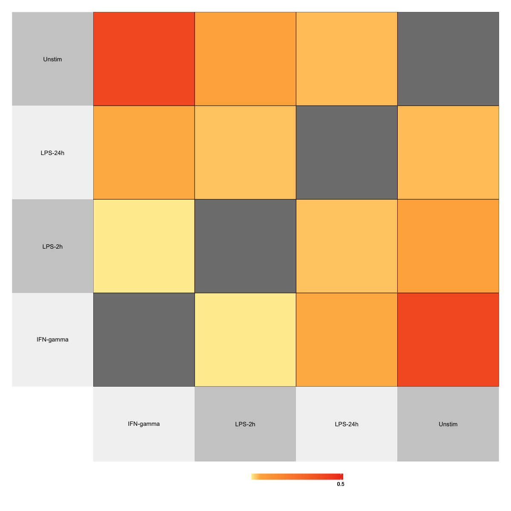
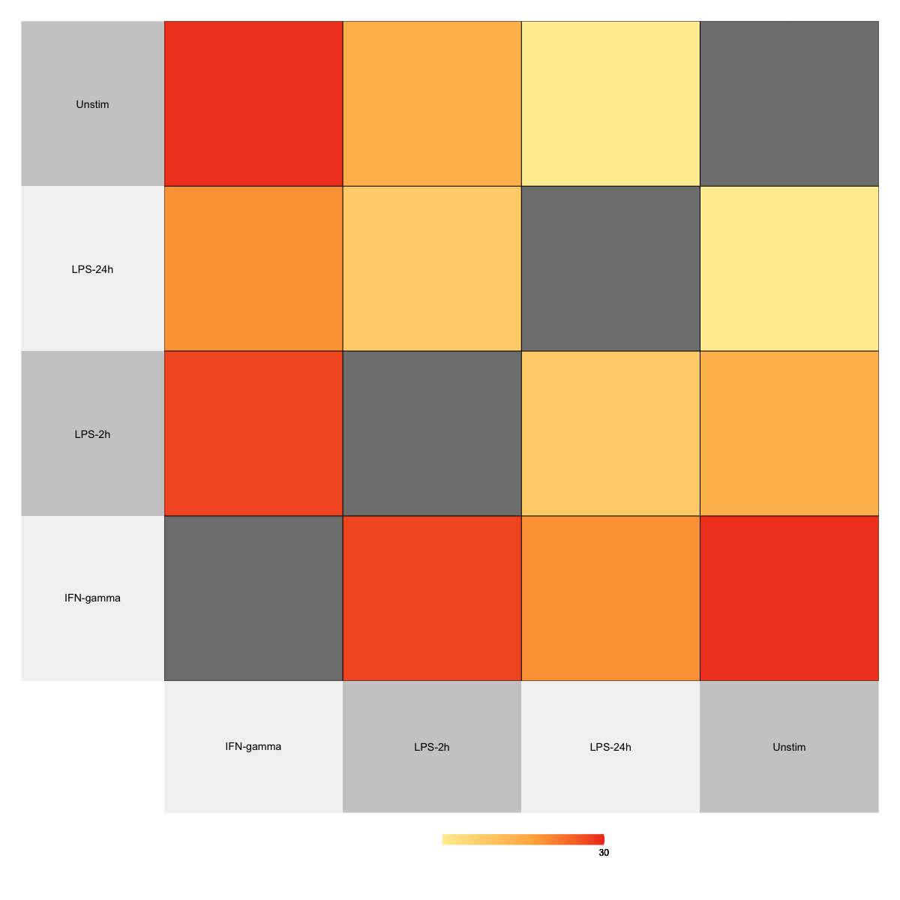

# Data description

Using a FDR threshold of $0.05$ for hotspot association, we get $p=381$ genes for each of the four conditions. We have $n_1=366$ samples for IFN-GAMMA, $n_2=260$ for LPS-2h, $n_3=321$ for LPS-24h, and $n_4=413$ for unstimulated cells.  

# Similarity of networks across conditions

Using Matthews' correlation coefficient for networks, we see that the networks of IFN-gamma and LPS24h are the most different to each other.

<!--This is confirmed by the hierarchical clustering algorithm applied to the data. We also see that LPS-2h is more similar to the unstimulated condition than LPS24h is. -->

{width=60%}

# Degree distributions 

## LYZ

LYZ has a relatively high degree in all conditions, though it is not among the top hubs in any of the conditions. It does not have any edges to other cis genes, except for in LPS-24 where there is an edge between LYZ and YEATS4. In fact, this is the only cis-cis edge across all conditions. This implies that the cis genes work independently, and do not regulate each other. 

{width=50%}


## YEATS4

YEATS4 also has a high edge degree in all networks, and is clearly a hub. 


{width=50%}

## CREB1

The mediator trans gene CREB1 also has a fairly high degree in all networks. 

{width=50%}

## Density plots

It apprears that the degree distribution of the unstimulated network has more density on lower degrees. Indeed, the unstimulated network is the sparsest among the four.

{width=50%}


## Density plots of top hotspot-controlled genes

The degree distribution of the genes controlled by the top hotspot clearly has the most mass on larger values in LPS-24h, implying more activity among these genes in this group.

{width=50%}


# Hubs

It can be relevant to investigate whether the conditions have common hubs. For this purpose, we consider hubs to be the nodes with edge degree larger than the $90$th percentile. This resulted in four lists with $56$, $46$, $49$ and $48$ genes for IFN-GAMMA, LPS-2h, LPS-24h and the unstimulated network respectively. The top hubs common to all four networks were: ACBD5, AFMID, AFTPH, AIRE, COX6A1, GIMAP1, IMPDH1, KIAA0101, LGALS3, RELB, SLC3A2, SORL1 and STAG3L3. 

LYZ and YEATS4 had many edges with the top hubs in all conditions. YEATS4 in particular is highly connected to the top hubs in each network, in addition to being a top hub in all networks but that of LPS-2h. 

Looking at the location of the top hubs, we see that they are fairly well spread out. 

{width=50%}

As we see from the heatmap, the unstimulated group and LPS-24h have the fewest common hubs. 

<!--Using hierarchical clustering to group the conditions based on common hubs, we see that LPS-2h and LPS-24h are clustered together.-->

{width=50%}

# Resulting networks

## Edges of LYZ gene

In the figure showing the subgraph with the edges of LYZ in the different conditions, a red edge indicates that the edge is unique to that condition. A blue edge is common across all networks, and a grey edge is present in two or three networks. Solid lines represent positive partial correlation while a dashed line represents negative partial correlation. Nodes are sized according to their edge degree, with larger size representing a higher degree. 

As we see, LYZ does not have a striking number of neighbors in IFN-GAMMA. On the other hand, it has more edges in the others, in particular LPS-2h which also has the most unique edges. We see that a lot of the edges of LYZ represent negative partial correlations, implying it could have a role in trans down-regulation in addition to up-regulation. 

The neighbors of LYZ common in the four networks are AFMID, LOC100128098, KLHL28, MAFF and SNRNP48. The partial correlations between LYZ and the the latter genes are negative in all conditions, and positive for the two former. 


## Edges of YEATS4 gene

YEATS4 has a high degree in all networks, and is among the top $10%$ hubs in all networks but that of LPS-2h. Evidently, it has many edges, corresponding to both positive and negative partial correlations. It is the cis gene with the overall highest degree in all conditions. 


## Edges of CREB1 gene

We also look at the edges of the trans gene CREB1, as it is found to have a mediating effect. CREB1 does not have any edges to the cis genes. 


## Edges of both LYZ and YEATS4 genes

We also show the edges of the two cis genes controlled by the top hotspot together.


## Full network

We also include the full network with all edges, though little can be concluded from this plot. 


# Network intersection

## All edges

As we see from the intersection plot, the networks have a fair share of edges in common. After the intersection of all conditions, the intersection with the largest edge set is LPS-2h and LPS-24h. This agrees with what we have seen previously. 


## Marked by hotspot contol


## Hubs


# Common parameter estimates

As we see, while many edges are found to be in common so that information is shared, there are still many network-specific eddges that have been captured. Thanks to the heavy horseshoe tail, we were able to capture these edges even though no common information about them was found between the conditions. 


# Enrichment analysis of hubs with enrichR

Exploring the top hubs of each network using enrichR. We use the data base "GO_Biological_Process_2015". 

```{r, echo=F,results='hide', message=FALSE}
library(enrichR)
load(file="data/temp.RData")
```


```{r, echo=F,results='hide', message=FALSE}
setEnrichrSite("Enrichr")
dbs <- listEnrichrDbs()
head(dbs)
dbs <- c("GO_Molecular_Function_2015", "GO_Cellular_Component_2015", "GO_Biological_Process_2015")
enriched.ifn <- enrichr(top.hubs[[1]], dbs)
enriched.lps2 <- enrichr(top.hubs[[2]], dbs)
enriched.lps24 <- enrichr(top.hubs[[3]], dbs)
enriched.unstim <- enrichr(top.hubs[[4]], dbs)

```


## IFN-GAMMA

```{r, echo=FALSE, message=FALSE}

plotEnrich(enriched.ifn[[3]], showTerms = 20, numChar = 40, y = "Count", orderBy = "P.value")
```

## LPS-2h

```{r, echo=FALSE, message=FALSE}
plotEnrich(enriched.lps2[[3]], showTerms = 20, numChar = 40, y = "Count", orderBy = "P.value")

```

## LPS-24h

```{r, echo=FALSE, message=FALSE}
plotEnrich(enriched.lps24[[3]], showTerms = 20, numChar = 40, y = "Count", orderBy = "P.value")
```

## Unstimulated

```{r, echo=FALSE, message=FALSE}
plotEnrich(enriched.unstim[[3]], showTerms = 20, numChar = 40, y = "Count", orderBy = "P.value")

```


# Enrichment of up-regulated genes in disease signatures

Exploring the top hubs of each network using enrichR. We use the data base "Disease_Signatures_from_GEO_up_2014". 


```{r, echo=F,results='hide', message=FALSE}
dbs = c("Disease_Signatures_from_GEO_up_2014", "OMIM_Disease", "Disease_Signatures_from_GEO_down_2014" )
enriched.ifn <- enrichr(top.hubs[[1]], dbs)
enriched.lps2 <- enrichr(top.hubs[[2]], dbs)
enriched.lps24 <- enrichr(top.hubs[[3]], dbs)
enriched.unstim <- enrichr(top.hubs[[4]], dbs)

```


## IFN-GAMMA

```{r, echo=FALSE, message=FALSE}

plotEnrich(enriched.ifn[[1]], showTerms = 20, numChar = 40, y = "Count", orderBy = "P.value")
```

## LPS-2h

```{r, echo=FALSE, message=FALSE}
plotEnrich(enriched.lps2[[1]], showTerms = 20, numChar = 40, y = "Count", orderBy = "P.value")

```

## LPS-24h

```{r, echo=FALSE, message=FALSE}
plotEnrich(enriched.lps24[[1]], showTerms = 20, numChar = 40, y = "Count", orderBy = "P.value")
```

## Unstimulated

```{r, echo=FALSE, message=FALSE}
plotEnrich(enriched.unstim[[1]], showTerms = 20, numChar = 40, y = "Count", orderBy = "P.value")

```

# Enrichment of down-regulated genes in disease signatures

Exploring the top hubs of each network using enrichR. We use the data base "Disease_Signatures_from_GEO_down_2014". 

## IFN-GAMMA

```{r, echo=FALSE, message=FALSE}

plotEnrich(enriched.ifn[[3]], showTerms = 20, numChar = 40, y = "Count", orderBy = "P.value")
```

## LPS-2h

```{r, echo=FALSE, message=FALSE}
plotEnrich(enriched.lps2[[3]], showTerms = 20, numChar = 40, y = "Count", orderBy = "P.value")

```

## LPS-24h

```{r, echo=FALSE, message=FALSE}
plotEnrich(enriched.lps24[[3]], showTerms = 20, numChar = 40, y = "Count", orderBy = "P.value")
```

## Unstimulated

```{r, echo=FALSE, message=FALSE}
plotEnrich(enriched.unstim[[3]], showTerms = 20, numChar = 40, y = "Count", orderBy = "P.value")

```

